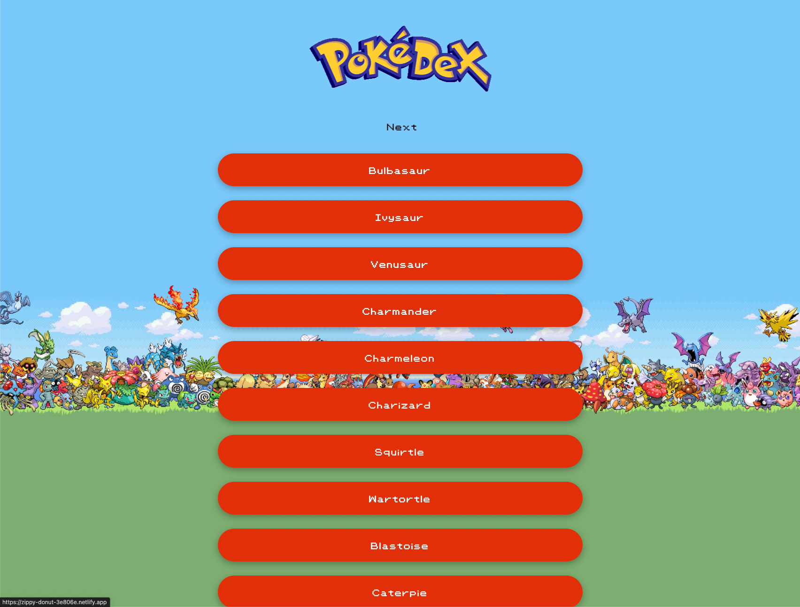

  

# Pokédex Web Application

Welcome to the Pokédex web application project. This README provides an overview of the project, instructions for setup, and key information about the code structure and dependencies.

## Project Overview

The Pokédex web application is a simple web-based Pokédex that enables you to explore and view details about various Pokémon. It is built using HTML, CSS, and JavaScript, with a user-friendly interface styled using Bootstrap. The application offers various functionalities for interacting with Pokémon data.

## Project Structure

- **index.html:** The main HTML file for the application.
- **dist/:** Contains the compiled CSS and JavaScript files.
- **files/:** Houses assets like images and fonts used in the application.
- **js/:** Includes additional JavaScript files, such as polyfills for older browser compatibility.
- **README.md:** The file you are currently reading.

## Dependencies

The Pokédex application relies on the following dependencies:

- **Bootstrap CSS:** Version 4.5.2
- **jQuery:** Version 3.3.1
- **Popper.js:** Included
- **Fetch Polyfill:** Used for compatibility with older browsers.
- **Promise Polyfill:** Used for compatibility with older browsers.

All dependencies are either included as external resources or locally within the project.

## Contributing

Contributions to this project are welcome. If you'd like to contribute, please follow these guidelines:

1. Fork the repository.
2. Create a new branch for your feature or bug fix.
3. Make your changes and commit them with clear, concise messages.
4. Create a pull request to the main branch of the original repository.

Please ensure that your code is well-documented and adheres to coding standards.

## Licenses

This project is licensed under the MIT License - see the [LICENSE](LICENSE) file for details.

© 2023 Pokémon. © 1995 - 2023 Nintendo/Creatures Inc./GAME FREAK inc.
